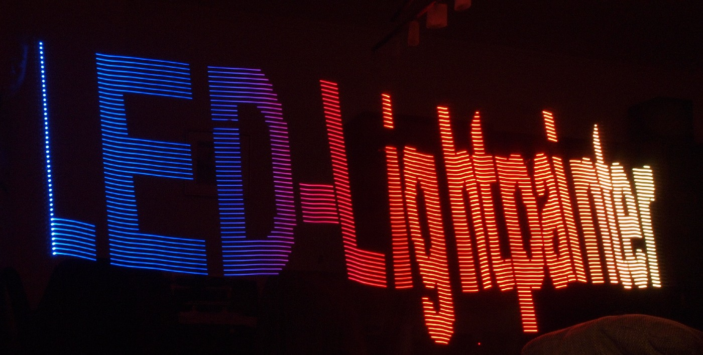

# LED-Lightpainter
A DIY Pixelstick clone for Light Painting using the ESP8266 and a WS2812 Strip (Neopixel)

## Introduction
Light painting is a technique to paint different patterns on a long exposure photograph by using a moving light source like a flashlight or in this case an WS2812 LED Strip.
This project uses a cheap ESP8266 based Microcontroller board (like [NodeMCU](https://en.wikipedia.org/wiki/NodeMCU), [WEMOS D1 mini](https://wiki.wemos.cc/products:d1:d1_mini) ) and an addressable WS2812 based LED strip. The number and density of the LEDs can be determined by you.

## Features
- Direct BMP support, no special conversion tools are needed. Just upload your 24 Bit BMP.
- The images are stored on the internal SPI-Flash in the SPIFFS Filesystem
- The images can be uploaded via Webinterface
- All configurations such as STA/AP Mode, number of LEDs, Pin for dataline of LED, Trigger-Pin, Image selection and time for each image row to be displayed are also be done in via Webinterface
- Automatic fallback to AP-Mode when the configured Wifi Station couldn't be connected
- Fallback to AP when trigger button is pressed on Bootup

## Compiling
- Open the project in PlatformIO. Edit the platformio.ini to match your board. 
leave the setting "platform=espressif8266@1.5.0" because with the newer Arduino framework you might get issues with the webinterface (due to a bug in streamFile-Function).
- Edit the configuration initialization according to your settings (Config configuration = ....) or leave it as it is. 
- Compile the Firmware and upload to your controller.
- Put your images to the data-folder of the project (or leave it as it is) and select "Upload SPIFFS image" to make the SPIFFS Filesystem ready.

## First start
- If you have not changed your settings in the source code, the controller will start in AP Mode after 10 Seconds since it couldn't connect to the default Station. After 10-15 Seconds connect to the AP "LED_PainterAP" with the password "ledpainter" and go to the url  http://192.168.4.1/config in your browser. Else go to http://esp8266.local/config or if this doesn't work to the IP which your ESP8266 got from your AP.
- Now set your configuration
- Click on **Store** to save the Settings permanent to the SPIFFS (as config.json) or click on **Set Temporarily** to store the settings in RAM. 
- **Attention:** LED Pin and Trigger Pin values are the integer values behind the Arduino Pin defines. So D5 of the NodeMCU is GPIO14 of the ESP8266 but the Arduino definition is just 14. So you have to enter 14 here.

## Prepare the Image
Before you upload an image to LED-Painter you have to generate an image with an image edititor of your choice.
- You have to rotate the image by 90° so that the bottom pixel row of the image is the first line to draw.
- Make sure the image width (after rotation) is the same as the number of LEDs you have (e.g. 60 for a 60 LED strip)
- Make sure you save the image as 24 Bit BMP.

## Upload and select the Image
- Go to your LED-Lightpainters IP (e.g. http://192.168.4.1/upload) to upload a file.
- Go to the configuration page http://192.168.4.1/config and click on browse to select the image. You will see a preview after selecting the image in the selection box. Click on **Select** to save. On the next page you may chose **Store** to save the selection in SPIFFS (only needed when you want to reboot but keep the image as default)

*Note: you can upload any file you want, but only bmp is displayed on the image selection page*
